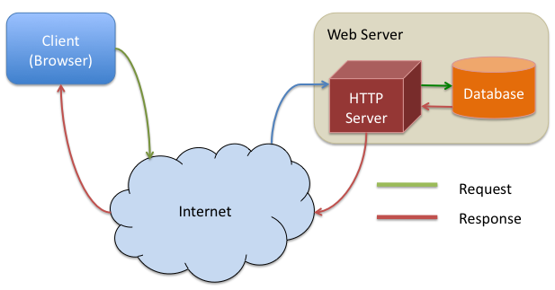

# RISE Firebase Workshop

## Resources

- [**Workshop Slides**](https://tinyurl.com/rise-firebase-workshop)

**Firebase Documentation**

- Setting up a Firebase Project
- Add Firebase to Application
  - [Web](https://firebase.google.com/docs/web/setup)
  - [iOS](https://firebase.google.com/docs/ios/setup)
  - [Android](https://firebase.google.com/docs/android/setup)
- Firestore [Data Model](https://firebase.google.com/docs/firestore/data-model)
- Using Firestore Database in App
  - [Add to Database](https://firebase.google.com/docs/firestore/manage-data/add-data)
  - [Delete from Database](https://firebase.google.com/docs/firestore/manage-data/delete-data)
  - [Fetch from Database](https://firebase.google.com/docs/firestore/query-data/get-data)
  - [Listen for Realtime Updates](https://firebase.google.com/docs/firestore/query-data/listen)
  - [Querying Database](https://firebase.google.com/docs/firestore/query-data/queries)
- Firebase Hosting: [initalize firebase](https://firebase.google.com/docs/cli#initialize_a_firebase_project)
  then [test and deploy](https://firebase.google.com/docs/hosting/deploying) your app
- Firebase Cloud Storage: store files, images, etc.
- Firebase Authentication

## This workshop will cover the following topics:

- [Firestore](#firestore)
  - [What are Databases?](#but-first-databases)
  - [Why Firestore?](#why-firestore)
  - [Firestore Data Model](#understanding-the-firestore-data-model)
  - Demo App
    - [Setup](#demonstration-integrating-firestore-with-a-react-app)
    - [Creating Firebase Project with Firestore](#creating-a-firebase-project)
    - [Using Firestore in Web App](#using-the-database-in-the-app)
- Cloud Storage
  - Buckets
  - References
  - Manipulating Contents of Buckets
  - Demo App
    - Add Cloud Storage to Firebase Project
    - Using Cloud Storage in Web App
- Authentication
  - Tokens
  - Security Rules
  - Demo App
    - Add Authentication
    - Work with Auth in Web App
    - Set up Security Rules
- Firebase Hosting
  - Firebase CLI
  - Deploying
  - Demo App
    - Add Hosting
    - Deploy our Web App

## Getting Started

You'll need:

- [Node](https://nodejs.org/) - we're using v14.0
- [Yarn 1.x](https://classic.yarnpkg.com/en/) - note we are not using Yarn 2.
- [Git](https://git-scm.com/downloads)
- Text editor of your choice, we're using [Visual Studio Code](https://code.visualstudio.com/)

# Firestore

## But First, Databases!

Before we get into using Firestore, let's understand the service that it
provides us: a database!

At a very basic level, a database is simply a collection of organized data.
Databases are designed to store information that can be accessed or modified
later on. This ends up being very useful when building an app to implement
the idea of **"persistent storage."**

Having a database allows an application to store and update information that
can then be used at any time. In other words, a user can come back to the
application and expect all their changes to still be present, WOW!

## Why Firestore?

Firestore is a service developed by Firebase that allows you, as a developer,
to create a database that you can use in any application you want! If you're
familiar with other backend technologies like MySQL or PostgreSQL, you might
be thinking "Why should I use Firestore instead?"

The reason we are using Firestore is because of how easy it is to use and
integrate into your application. Usually, databases require a middleman
called a "server" which handles requests from an application to fetch the
specified data stored in the database.

Firestore **ELIMINATES the need for server development**, hence why we say that
using Firestore lets us go "Serverless." While in reality, there still is a
server involved, this server is no longer something that you, the developer,
needs to worry about creating or maintaining.

## Advantages of "Serverless" Development

Now with Firestore, we no longer need to set up endpoints of communication
between databases and applications ourselves. This means we can
**develop without limits!** :0

For example, say we wanted to add a feature to a music player application
that allows users to create groups of songs from a library (playlist management).

Without Firestore, we would first need to create a place in our database to
support the storage of playlists and their associated songs for each user.
Then after that we would also need to implement server-side logic to let our
application make requests to fetch the playlist data for a given user, to
modify the available playlists for a specfic user (creation and deletion),
and to change the songs inside of one of the user's playlists.

With Firestore, this entire process is made faster and easier with a few key
library functions made available to us in any application that has Firebase
set up.

## Understanding the Firestore Data Model

As opposed to many SQL databases you may be familiar with, Firestore is what's
known as a NoSQL, Document-Oriented Database.

This means that instead of using tables to store related data, Firestore uses
"collections" of "documents," each containing some labeled pieces of data.

Woah, colllections? Documents? What does any of that mean? Let's take a look and
see if we can understand the way Firestore organizes its data a little better.

## Collections

Collections are pretty simple to understand, they simply act as **containers that
consist of multiple documents**. We usually use a collection to denote some set of
related documents.

## Documents

Okay, so if a collection just holds documents then what the heck is a document?

Documents are referred to as the **unit of storage in Firestore**. What this means
is that all physical data (names, dates, objects, etc) in your Firestore database
will be located inside some document.

Every document in your database is identified by some unique name within its
collection. Each document stores a set of data in the form of **key-value pairs,**
which might look something like this:

![]

Each piece of data is labeled by a field name or **key**, and this key identifies
what the **value** it maps to represents.

These are the basic parts of any Firestore database, if you want to dive a little
deeper I encourage you to look at the Firestore
[data model documentation](https://firebase.google.com/docs/firestore/data-model).
